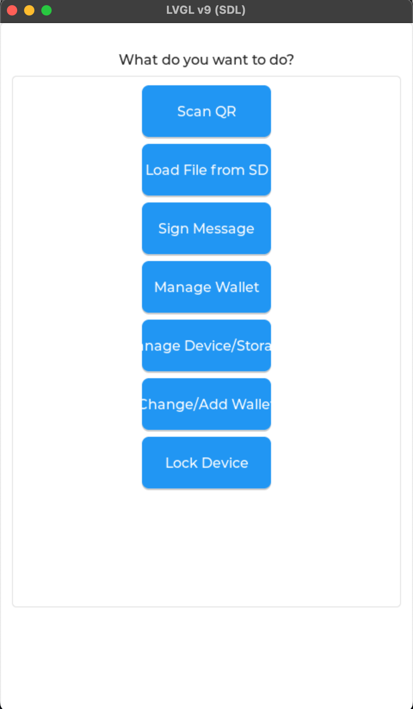
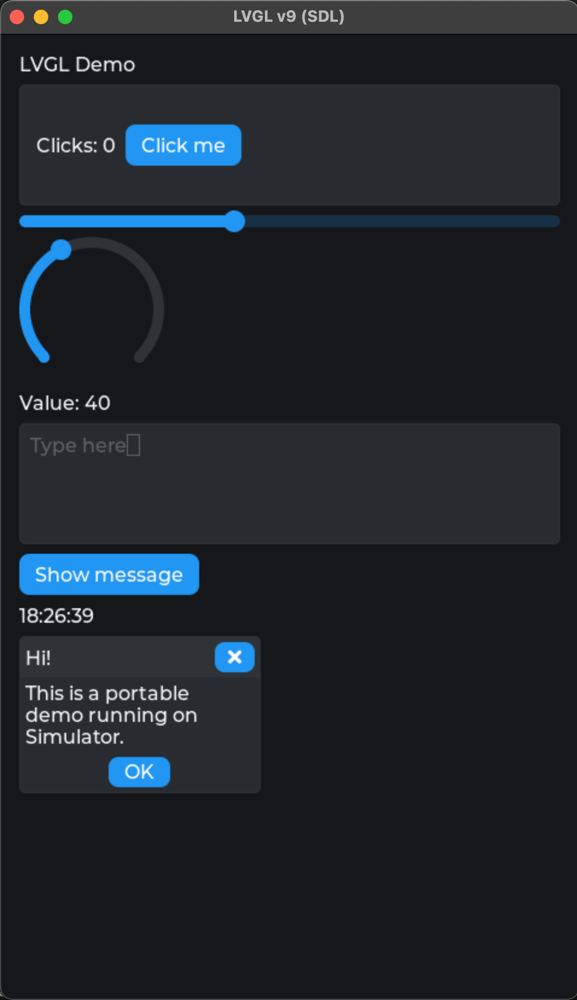

# Specter-Playground

    "Cypherpunks write code. We know that someone has to write software to defend privacy, 
    and since we can't get privacy unless we all do, we're going to write it."
    A Cypherpunk's Manifesto - Eric Hughes - 9 March 1993

    ...and Cypherpunks do build their own Bitcoin Hardware Wallets.


The idea of the project is to provide a playground for everyone to play with a software which can potentially run on the Specter Hardware, a F469-Discovery board from STMicroelectronics.

## setup
```
# in an empty dir
git clone https://github.com/cryptoadvance/specter-diy.git
cd specter-diy
git fetch origin pull/304/head:pr-304
git checkout pr-304
git submodule sync --recursive
git submodule update --init --recursive --checkout
make unix
./bin/micropython_unix f469-disco/usermods/udisplay_f469/udisplay_demo.py
```

```
# install nix
# install direnv
direnv allow
make unix
make simulate
# hack on address_navigator.py
```

## Scenarios

Different UI scenarios can be tested using the `SCRIPT` parameter:

```bash
# Default - runs mock_structure.py (main navigation menu)
nix develop -c make simulate SCRIPT=mock_structure.py

# Run address_navigator scenario
nix develop -c make simulate SCRIPT=address_navigator.py

# Run udisplay_demo scenario
nix develop -c make simulate SCRIPT=udisplay_demo.py
```

### Mock Structure


### Address Navigator


### UDisplay Demo

