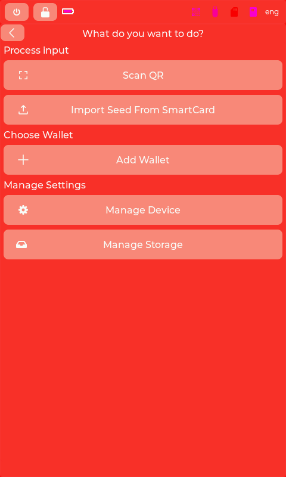
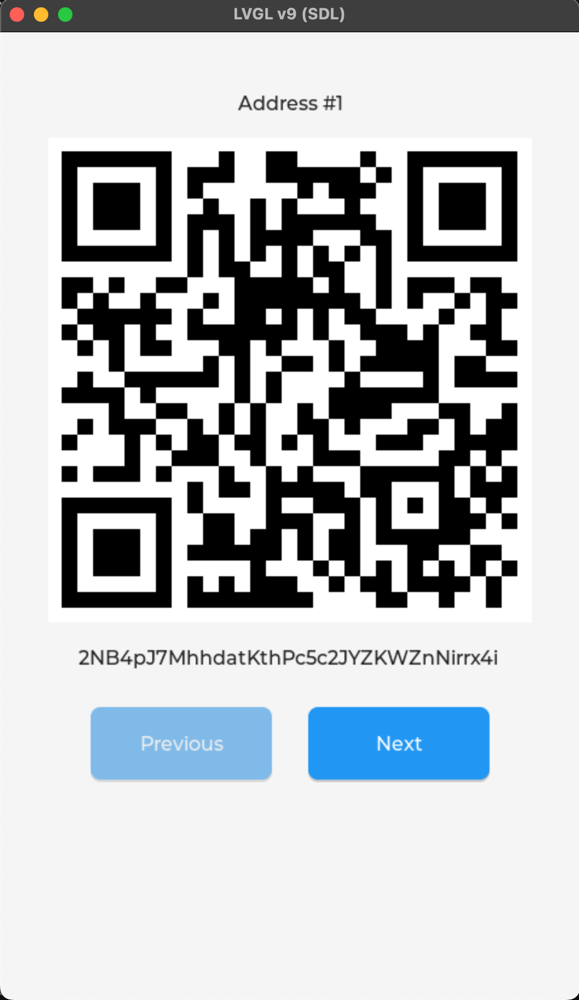
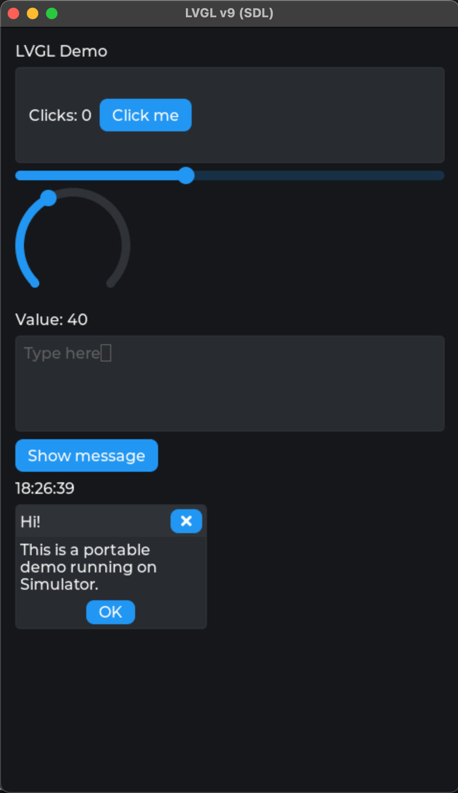

# Specter-Playground

    "Cypherpunks write code. We know that someone has to write software to defend privacy, 
    and since we can't get privacy unless we all do, we're going to write it."
    A Cypherpunk's Manifesto - Eric Hughes - 9 March 1993

    ...and Cypherpunks do build their own Bitcoin Hardware Wallets.


The idea of the project is to provide a playground for everyone to play with a software which can potentially run on the Specter Hardware, a F469-Discovery board from STMicroelectronics.

## setup
```
git clone --recurse-submodules https://github.com/k9ert/specter-playground.git
cd specter-playground
# install nix + direnv, then:
direnv allow
make simulate            # build and run the MockUI simulator
```

If you cloned without `--recurse-submodules`, run `git submodule update --init --recursive`.

Unit tests (`make test` runs the i18n build first, which generates `translation_keys.py`):

```
python3 -m venv .venv && .venv/bin/pip install -r requirements.txt
make test
```

Simulator and hardware control for development and tests lives in the [`devtools/`](devtools) submodule; see the [specter-devtools README](https://github.com/maggo83/specter-devtools#readme) for its setup and commands. `make simulate-automation` starts the simulator with its control server.

## Scenarios

Different UI scenarios can be tested using the `SCRIPT` parameter:

```bash
# Default - runs the MockUI (scenarios/mockui_fw/main.py)
nix develop -c make simulate

# Run address_navigator scenario
nix develop -c make simulate SCRIPT=address_navigator.py

# Run udisplay_demo scenario
nix develop -c make simulate SCRIPT=udisplay_demo.py
```

### MockUI


MockUI's start state can come from a preset: with `MOCKUI_PRESET=<name>`, `make` copies `scenarios/mockui_fw/presets/<name>.json` to `/flash/presets/mockui.json`. The preset sets `DeviceState` and `UIState` attributes and lists seeds and wallets. Without `MOCKUI_PRESET` there is no preset and MockUI starts from the defaults, as in a release build. `make simulate` and `make simulate-automation` use `dev` (locked with PIN 21, test seeds and wallets, every peripheral present). Add your own preset rather than editing `main.py`.

```bash
# Simulator without a preset
nix develop -c make simulate MOCKUI_PRESET=

# Board firmware with the dev preset
nix develop -c make mockui MOCKUI_PRESET=dev
```

### Address Navigator


### UDisplay Demo

